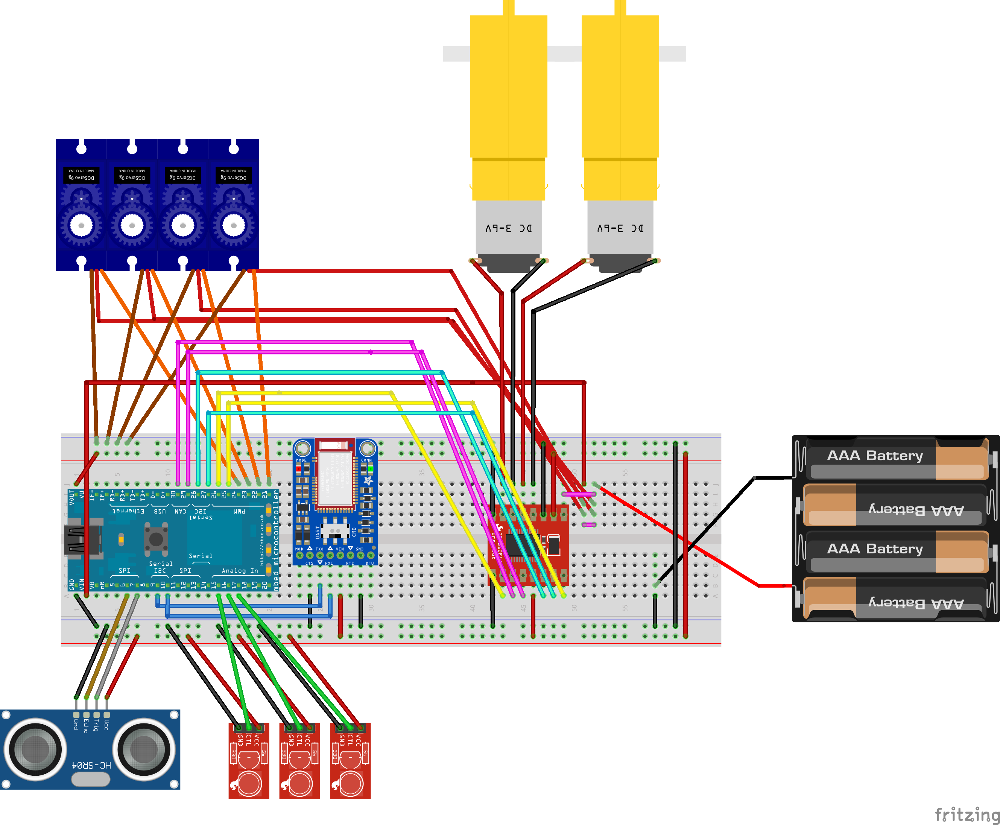

# Line Following Rover with Robotic Arm
ECE 4180 Spring 2024 Final Project, Georgia Institute of Technology

Project Members: Devansh Singh, Nicholas Graham, Tejasvi V Yadavalli

This project implements a versatile rover equipped with a robotic arm, capable of line following. It utilizes the ARM mbed platform for development.

## Project Idea
A line-following rover with a servo-controlled robotic arm. The rover can move forwards, backwards, left, and right in the manual state. The rover also has an autonomous line following state where it follows a dark line with IR sensors. The servo-controlled arm can move up, down, left, and right in the arm state. The purpose of the arm is to move objects that are in the way of the rover. The purpose of the project was to create a smaller scale version of an excavator with an autonomous line following function to simulate a method of moving a large excavator without human control. This line following function could be beneficial in storing large numbers of excavators at a time in warehouses.

Click the image below to watch an example of a demo.

## Features

- **Rover Movement**: The rover can move forward, backward, turn left, and turn right.
- **Robotic Arm Control**: The robotic arm can be controlled to move up, down, left, and right
- **Line Following**: Incorporates IR sensors for line following, allowing the rover to autonomously follow lines.
- **Modular Design**: Easily expandable and customizable for additional functionalities.

## Hardware Components

- **mbed LPC1768**: The heart of the system, controls all functions.
- **(2) DC Motors and Motor Driver (TB6612FNG)**: For rover movement.
- **Mechanical Arm**: For the robotic arm.
  - https://www.amazon.com/gp/product/B07ZYZVNY4/ref=ox_sc_saved_title_1?smid=A15IQBE9R3BCI4&psc=1
- **(4) 9G Servo (MG90S) Motors**: For the robotic arm control.
- **Laser Cut Acrylic and Appropriate Nuts/Bolts**: For the robotic arm material.
- **(3) IR Sensors**: for line following.
  - See: https://www.sparkfun.com/products/11769
- **6V Battery Power Supply**: (4) Batteries or external power source.
- **Chassis and Wheels**: Physical structure for the rover.
  - See: https://learn.sparkfun.com/tutorials/assembly-guide-for-redbot-with-shadow-chassis/introduction
- **(4) AA Batteries**: to power the motor driver and the mbed
- **Bluetooth LE UART Module**: for remote control

## Schematic

## Software Components

- **mbed RTOS**: Provides the operating system and hardware abstraction layer for threading and interrupts.
  - main.cpp
    - Rover Motor Control (LeftRightMotor())
    - Arm Control (check_move_arm())
    - Bluetooth (bluetooth_thread())
    - Line Following (IR_thread())
    - **Defunct**: Distance Sensing (ultrasonic_loop())
- **mbed APIs**: Libraries for motor control, sensor interfacing, and communication.
  - def.h
- **Control Algorithms**: Implementations for rover movement, arm control, and line following.
- **Line Following Algorithm**: Determines rover behavior based on sensor input.

## Instructions

### Rover Assembly
To assemble the Rover use the following pages:
- [Motors and Wheels](https://learn.sparkfun.com/tutorials/assembly-guide-for-redbot-with-shadow-chassis/2-motors-and-wheels)
- [Line Follower](https://learn.sparkfun.com/tutorials/assembly-guide-for-redbot-with-shadow-chassis/3-line-follower)
- [Chassis](https://learn.sparkfun.com/tutorials/assembly-guide-for-redbot-with-shadow-chassis/5-chassis)

### Arm Assembly
To assemble the Arm use the following pages:
- [Smart Robot Arm Kit Manual](https://www.dropbox.com/sh/8c8xaqfsh8jiyel/AACQizMHrRqQSzIDUiasagWTa/LAFVIN%20Smart%20Robot%20Arm%20Kit?dl=0&preview=Smart+Robot+Arm+Kit.pdf&subfolder_nav_tracking=1)
  - Consider only Slide 46 to Slide 84

## How to Operate
1. Power the mbed using the external battery.
2. Use the 'Bluefruit Connect' app to connect to the Rover's Bluetooth module.
3. The Rover's State Machine will transition to MANUAL.
4. Go to the 'Control Pad' UI in the app.
5. To move the Rover, use the arrow keys. To transition states, use the number pad:
   - 1: Manual
   - 2: Line Following
   - 3: Arm Control
6. Press '2' to make the Rover autonomously Line-Follow along a black line. It will stop moving when it does not detect a black line.
7. Press '3' to control the arm via Bluetooth commands using the arrow keys.

## License

This project is licensed under the MIT License.
